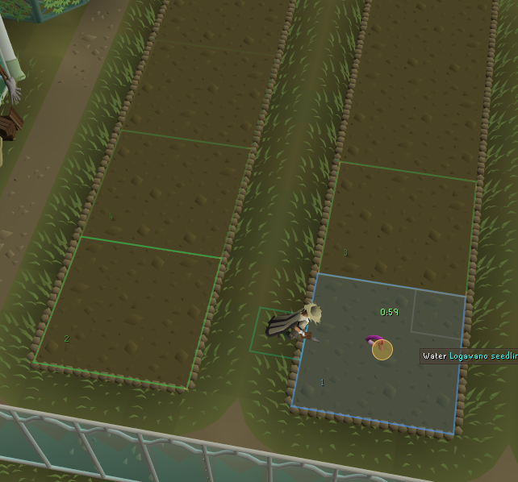
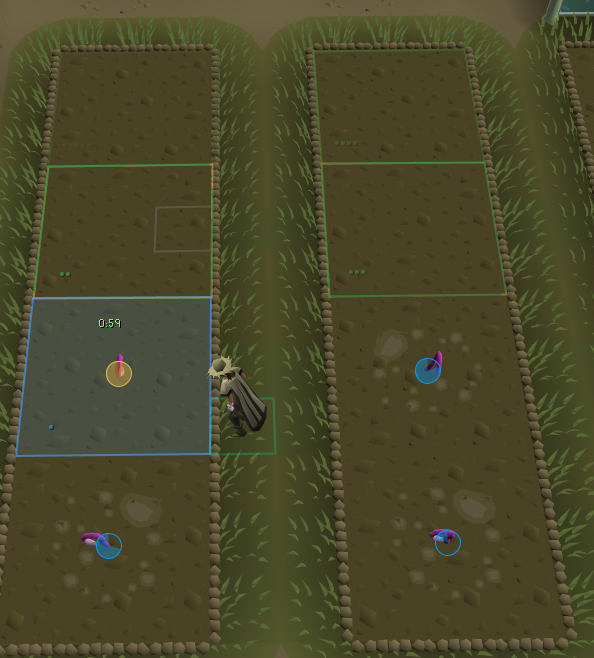
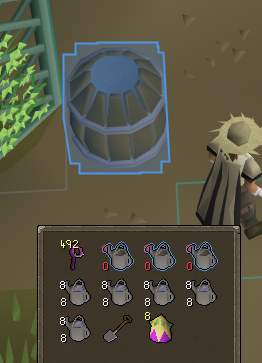
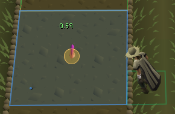
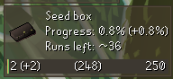

  

<h1 align="center">Easy Tithe Farm</h1>

Easy Tithe Farm is a RuneLite plugin that turns the Tithe Farm minigame into a follow-the-lights run. It lights up the plot to click next in a color that tells you what to do there, keeps count of your water so you never run dry, and warns you before a plant dies. Pick how many crops you want to grow and just follow the glow.

## Features

### Know what to click next

- **Follow the lights**

  The plot to click now glows brightest, and the next four plots glow after it, each one a little fainter. Click the bright one, and the next one takes its place. You never have to remember where you are in your run.

- **Colors that say what to do**

  Green means plant, blue means water, yellow means harvest, and red means clear a dead plant. When it's time to plant, the seed in your backpack glows green too, and when it's time to water, your watering can glows blue. Once you carry 100 or more fruit, the fruit and the sacks glow orange so you know to drop them off between runs. You can change any color in the settings.

- **Step markers**

  Each glowing plot shows its place in line: 1 for the plot to click now, then 2 to 5 for the ones after it. Pick **Numbers**, **Blips** (that many small dots), or **Off** in the settings.

   

- **Glow**

  All the highlights gently pulse together. Make the pulse slow, medium, or fast, or turn it off for a steady glow.

### Never run out of water

- **Water counted for you**

  A small panel shows the next thing to do, how much water you carry, and how much the rest of your run needs. It counts both regular watering cans and Gricoller's can.

- **Refill reminder**

  Between runs, any watering can that isn't full glows blue along with the water barrels, and the plugin waits for you to fill up before the first seed goes in. If your plants ever need more water than you carry, the panel turns red and you get a notification, even if you're tabbed out.

  

- **No wasted seeds**

  If you don't have enough water to finish growing another seed, the plugin stops you from planting it by mistake. You can turn this off with **Prevent planting (low water)**.

### Play tired, play safe

- **Plant timers**

  A countdown sits over every plant waiting for water and turns yellow, then red, as time runs out. Turn on **Notify before a plant dies** to get a heads-up if you get pulled away mid-run.

  

- **Tool check**

  A red warning appears if you forgot your spade, seed dibber, or watering can, or if your run energy gets low. Learned to plant barehanded from Barbarian Training? Turn on **I plant barehanded** and the missing dibber won't be flagged.

- **Stay on the route**

  With **Prevent watering out of order** on, left-clicking any plant except the glowing one does nothing, so a misclick won't send you the wrong way. Right-click still works if you really mean it. **Prevent planting wrong plot** does the same for seeds.

- **Minimal view**

  One switch hides everything except the plot to click now and the warnings that matter.

### Plan your run

- **Built-in routes**

  The planting routes from the OSRS Wiki guide are built in. Set how many crops you want to grow, and the plots light up in the right order.

- **Plant your own way**

  Plant somewhere other than the glowing plot and the plugin adjusts the route to match, then sticks with it through every harvest and replant.

- **Record your own route**

  Prefer your own order? Turn on **Record route**, plant one run the way you like, and the plugin remembers it from then on.

### Track your progress and rewards

- **Tonight's progress**

  The panel shows your Tithe Farm points, the Farming experience you've earned this session, and how long you've been farming. It also shows how much the fruit in your backpack will add once you drop it off. Wearing the Farmer's outfit? Its experience bonus is counted.

- **Reward goals**

  Tick the Tithe Farm rewards you're saving for, like the Farmer's outfit, seed packs, or herb boxes. A goal box shows your progress, a points bar, and about how many runs you have left. It says "ready!" once you have enough points.

  

- **Goal notification**

  Get a notification the moment you have enough points for everything you ticked.

## Links

- [Report a bug](https://github.com/Oveduumnakal/Easy-Tithe-Farm/issues/new?template=bug_report.yml)
- [Request a feature](https://github.com/Oveduumnakal/Easy-Tithe-Farm/issues/new?template=feature_request.yml)
- [Buy me a coffee](https://buymeacoffee.com/oveduumnakal)
