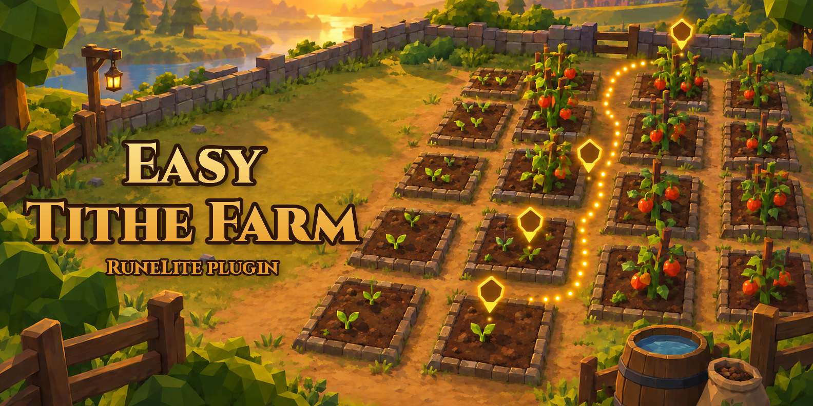

  

<h1 align="center">Easy Tithe Farm</h1>

Easy Tithe Farm is a RuneLite plugin that turns the Tithe Farm minigame into a follow-the-lights run:
it plans an efficient planting route for the number of crops you want to grow (or the one you record),
lights up what to click next in a color that says what to do, tracks your water, and stops you from planting
a seed you cannot finish watering.

## Features

### Plan the run

- **Wiki planting routes**

  The routes from the OSRS Wiki strategy guide are built in — basic (20), combo (20), and simple (23) — and
  they set the order the plots light up in. Set your crop count and the route is cut to it (the wiki's basic
  route works at 16 too). Prefer something else? The automatic route loops down one pair of columns and back
  up the next, sized to your crop count, so you always finish beside your first plot.

- **Adapts to how you plant**

  Plant somewhere other than the highlighted plot and the route re-plans around you: the seeds you have put in
  keep their order, and the rest of the run becomes the shortest orderly loop from your newest plant back to
  your first, using real walking distances through the farm. Follow it and it stays put — through every
  harvest and replant round.

- **Record your own route**

  Prefer your own order? Turn on **Record route**, plant a run the way you like, and the plugin saves that
  order and switches to it once you have planted your crop count. It survives every new farm instance.

### Know what to click next

- **Brain-off highlights**

  The plot to click now and the next four after it are lit up, brightest first and fading evenly
  (100%, 78%, 55%, 33%, 10%). Each plot appears once, at its nearest action, in your route's order. The
  current plot is always exact; the fading trail is a prediction that assumes about three game ticks per
  action and plants growing on schedule. Every seed is watered as it goes in, and the plugin keeps you on
  your planting pass until a plant actually needs you, instead of dragging you back the moment it grows.

- **Colors that say what to do**

  Plant is yellow, water is blue, harvest is green, clear dead is red, and deposit is gold-orange. When you
  plant, the seed in your backpack glows yellow with the plot; when you water, a filled watering can glows
  blue with it. Carrying 100 or more fruit, the fruit stack and both sacks glow gold-orange. Anything else,
  like the sacks when a full backpack needs emptying mid-run, is white. Each highlight outlines the whole plot, with no text
  drawn on it; only the plot to click now is also lightly filled, so it stands out from the ones after it.
  Inventory items are traced along their own outline. Every color can be changed in the Colors section.

  Fruit is deposited in batches of 100, between runs like the water refill: once you carry 100 or more and
  nothing is growing, the sacks light up before the first seed goes in. A smaller haul stays in your backpack.
  Mid-run, the plugin only sends you to the sack, and lights it, when a harvest would not fit; with no fruit to
  deposit, it asks you to free a slot instead.

- **Glow**

  All highlights pulse together. Pick Slow (2.4 s), Medium (1.2 s, the default), Fast (0.6 s), or Solid for
  no pulse.

- **Run panel**

  A small panel shows the next action, the water you carry, and the water the run still needs.

### Play tired, play safe

- **Plant timers**

  A countdown sits over every plant waiting for water, turning yellow, then red, as it gets close — and an
  optional notification fires before one dies, for when life pulls you away mid-run.

- **Tonight's progress**

  Your points, experience gained this session, and time in the farm. The points and experience each show a
  (+n) for what the fruit in your backpack would add once deposited, using the wiki's sack rules: a point for
  every third fruit in the sack, 2 more at the 100th (35 per full sack), and double experience from the 75th
  fruit plus its flat bonus. The Farmer's outfit pieces you wear are counted (up to 2.5% for the full set).

- **Tool check and run energy**

  A red warning if your spade, seed dibber, or watering can is missing, if Gricoller's fertiliser is in your
  backpack, or if run energy drops low — with your energy or stamina potion boxed. Finished the Barbarian
  Training farming step? Turn on **I plant barehanded** and a missing dibber is not flagged.

- **Minimal view**

  One switch strips everything back to the warnings that matter and the current plot alone — no fading
  trail and no inventory boxes.

### Never run dry

- **Water tracking**

  Counts regular watering cans and Gricoller's watering can automatically. What the run needs is read from
  your plots — waters still owed by planted crops plus three for each seed still to go in — so the number
  stays correct as you water, and it never cries wolf mid-run.

- **Refill reminder**

  Between runs, every watering can that is not full (a regular can under 8, Gricoller's can under 1,000)
  and the water barrels glow blue, and the first seed waits until every can is full. If your water will not
  finish a run already under way, the panel turns red and the cans and barrels glow blue, and a notification
  fires once so you catch it even while tabbed out. It is on by default and follows RuneLite's usual
  notification settings (tray, sound, focus, and so on).

- **Prevent planting (low water)**

  Before each seed, the plugin checks the whole rest of the run: your water must cover what your planted crops
  still need plus three for every seed the run still has room for. If it does not, "Cancel" moves to the top
  of the menu so a stray click cannot sink a seed you cannot water through to harvest. It only reorders the
  menu — nothing is ever removed — and you can turn it off.

### Save for rewards

- **Reward goals**

  Tick the Farmer Gricoller rewards you are saving for, with a quantity for the repeatable ones like seed packs
  or herb boxes. A goal box at the farm and in the lobby shows the combined cost, your progress, a points bar,
  and roughly how many runs are left at your crop count, counting the fruit in your backpack as if deposited.
  It reads "deposit" when depositing that fruit is all you still need, and "ready!" once your points cover the
  goal. It warns if the total is more than the 16,000 points you can hold.

- **Goal notification**

  An optional notification fires once, the moment your points cover everything you ticked.

## Links

- [Report a bug](https://github.com/Oveduumnakal/Easy-Tithe-Farm/issues/new?template=bug_report.yml)
- [Request a feature](https://github.com/Oveduumnakal/Easy-Tithe-Farm/issues/new?template=feature_request.yml)
- [Buy me a coffee](https://buymeacoffee.com/oveduumnakal)
